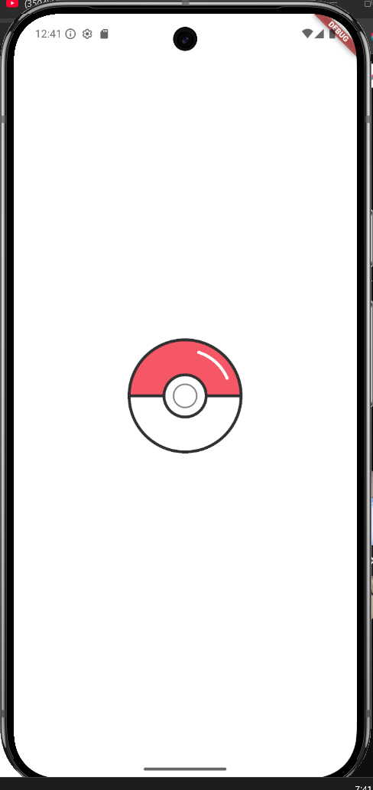
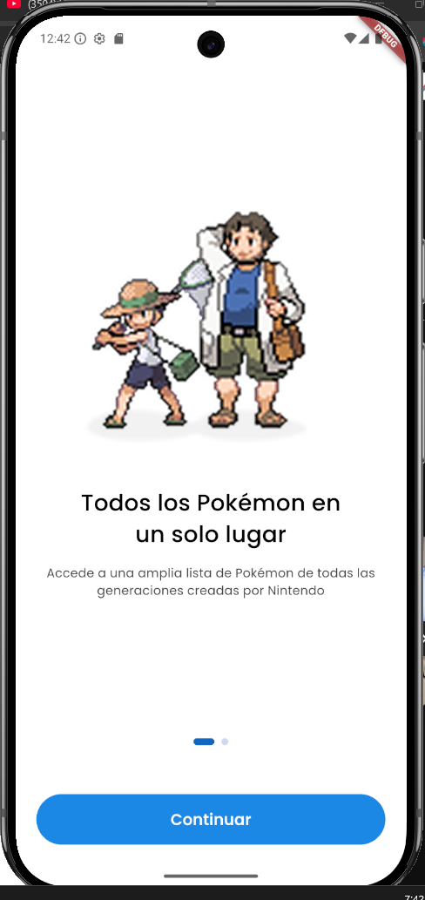
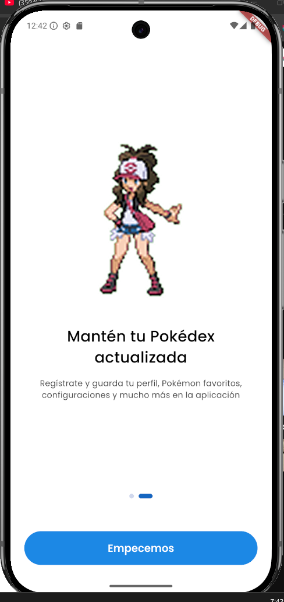
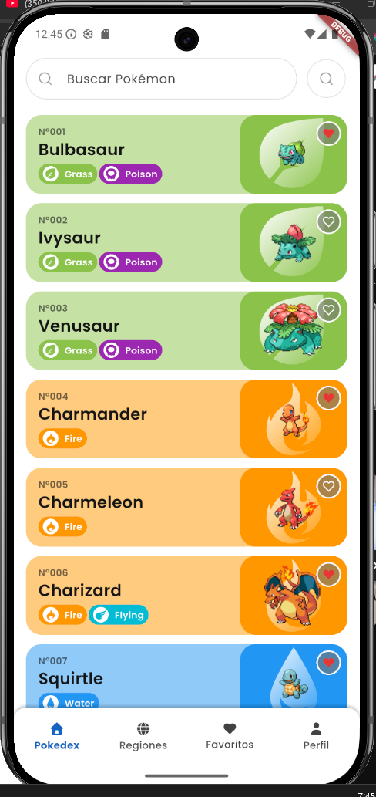
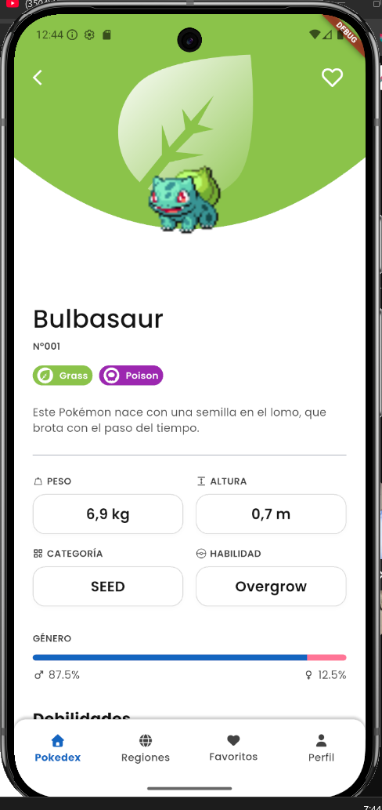
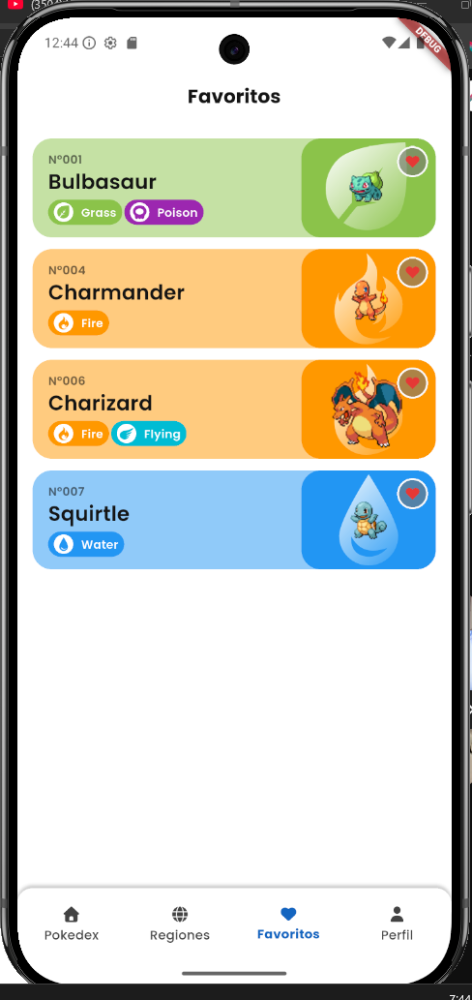
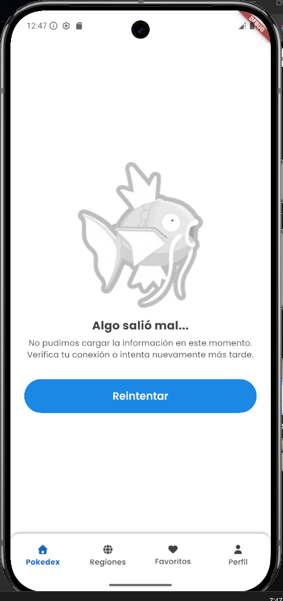
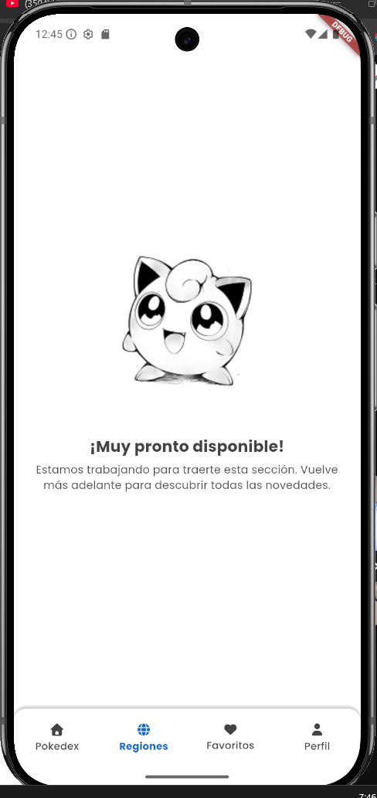
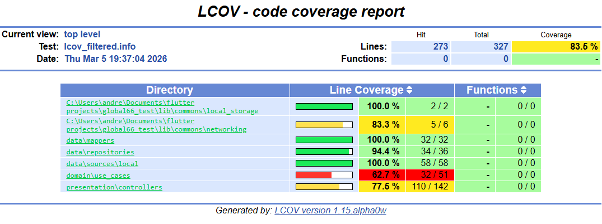

# Global66 Test - Pokedex App

Este proyecto es una aplicación de Pokedex desarrollada en Flutter como parte del desafío técnico para Global66. La aplicación permite explorar Pokémon, ver sus detalles, buscar por nombre y gestionar una lista de favoritos.

## 🚀 Características Principales

*   **Splash Screen**: Implementado para una carga inicial fluida y profesional.
*   **Onboarding**: Pantalla de introducción informativa con persistencia de estado (solo se muestra la primera vez).
*   **Listado de Pokémon**: Scroll infinito con paginación para explorar todos los Pokémon.
*   **Búsqueda**: Funcionalidad para buscar Pokémon por nombre en tiempo real.
*   **Detalle de Pokémon**: Vista detallada con estadísticas, tipos, peso, altura y sprites.
*   **Favoritos**: Sistema de persistencia local para guardar y gestionar tus Pokémon favoritos.
*   **Diseño Responsivo**: Adaptado a diferentes tamaños de pantalla siguiendo un Design System propio.

## 🛠️ Tech Stack & Herramientas

El proyecto utiliza un stack moderno y robusto enfocado en la escalabilidad y mantenibilidad:

*   **Framework**: [Flutter](https://flutter.dev/) (SDK ^3.5.0)
*   **Lenguaje**: Dart
*   **Gestión de Estado**: [Riverpod](https://riverpod.dev/) (con `riverpod_annotation` y `riverpod_generator`)
*   **Arquitectura**: Clean Architecture (Capas de Data, Domain y Presentation)
*   **Networking**: [Dio](https://pub.dev/packages/dio) para peticiones HTTP a la [PokeAPI](https://pokeapi.co/).
*   **Inmutabilidad & Generación de Código**:
    *   [Freezed](https://pub.dev/packages/freezed) para Data Classes y Uniones.
    *   [JsonSerializable](https://pub.dev/packages/json_serializable) para serialización JSON.
*   **Persistencia Local**: [Shared Preferences](https://pub.dev/packages/shared_preferences) para guardar favoritos y estado de onboarding.
*   **UI/UX**:
    *   [Flutter SVG](https://pub.dev/packages/flutter_svg) para iconos vectoriales.
    *   [Google Fonts](https://pub.dev/packages/google_fonts) para tipografía.
    *   **Atomic Design**: Implementación de componentes reutilizables (Atoms, Molecules, Organisms).
*   **Testing**:
    *   `flutter_test` para pruebas unitarias y de widgets.
    *   `mocktail` y `mockito` para simulación de dependencias.
    *   `lcov` para reportes de cobertura de código.

## 🏗️ Arquitectura

El proyecto sigue los principios de **Clean Architecture** para separar responsabilidades y hacer el código testeable e independiente de frameworks externos.

```
lib/
├── commons/            # Utilidades compartidas (Constants, Network, Storage)
├── design_system/      # Componentes UI (Theme, Atoms, Molecules, Organisms)
├── features/           # Módulos funcionales (Auth, Home, Pokedex, Splash)
│   ├── pokedex/
│   │   ├── data/       # Implementación de repositorios, fuentes de datos y modelos (DTOs)
│   │   ├── domain/     # Reglas de negocio (Entidades, Repositorios abstractos, Casos de Uso)
│   │   └── presentation/ # UI y Gestión de Estado (Controllers, Screens, Widgets)
├── l10n/               # Configuración de localización e internacionalización
└── main.dart           # Punto de entrada de la aplicación
```

### Capas

1.  **Domain**: Es el núcleo de la aplicación. Contiene las Entidades (objetos de negocio) y los Casos de Uso (lógica de aplicación). No depende de ninguna otra capa.
2.  **Data**: Implementa las interfaces definidas en Domain. Se encarga de obtener datos de fuentes remotas (API) o locales (Base de datos/Preferencias) y mapearlos a Entidades.
3.  **Presentation**: Contiene la UI (Widgets) y la lógica de presentación (State Management con Riverpod). Se comunica con la capa de Dominio a través de Casos de Uso o Repositorios.

## 🧪 Testing

El proyecto cuenta con una suite de pruebas que cubre las capas críticas de la aplicación.

### Ejecutar Pruebas
Para correr todos los tests:
```bash
flutter test
```

### Generar Reporte de Cobertura
Para generar un reporte de cobertura de código (requiere `lcov` instalado):

1.  Ejecutar tests con flag de cobertura:
    ```bash
    flutter test --coverage
    ```
2.  Generar HTML (opcional, si tienes lcov instalado):
    ```bash
    genhtml coverage/lcov.info -o coverage/html
    ```
    El reporte se generará en `coverage/html/index.html`.

## 🚀 Instalación y Ejecución

1.  **Clonar el repositorio**:
    ```bash
    git clone <URL_DEL_REPOSITORIO>
    cd global66_test
    ```

2.  **Instalar dependencias**:
    ```bash
    flutter pub get
    ```

3.  **Generar código (Build Runner)**:
    Es necesario ejecutar el generador de código para Freezed, Riverpod y JSON Serializable:
    ```bash
    dart run build_runner build --delete-conflicting-outputs
    ```

4.  **Ejecutar la aplicación**:
    ```bash
    flutter run
    ```

## 📝 Notas Adicionales

*   **Linting**: El proyecto utiliza `flutter_lints` para asegurar la calidad y consistencia del código Dart.
*   **Assets**: Los recursos gráficos se encuentran organizados en `assets/svg` y `assets/png`.

## 📸 Galería

| Splash | Onboarding | Home |
|:---:|:---:|:---:|
|  |  <br>  |  |

| Detalle | Favoritos | Otros |
|:---:|:---:|:---:|
|  |  |  <br>  |

### Reporte de Cobertura


